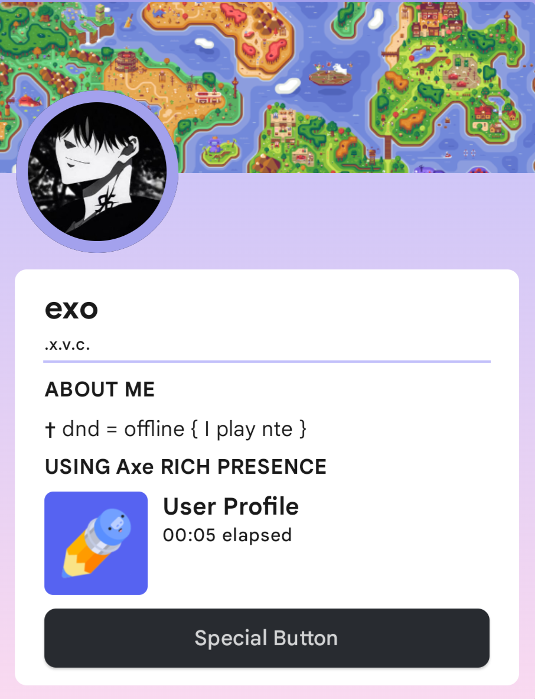

<div align="center">


<a href="https://github.com/sudoloser/axe/releases/latest">

</a>


</div>


<div align="center">
<h1>Axe</h1>
<h4>A fork of Kizzy, a Discord Rich Presence manager for Android fully written in Kotlin.
</h4>
<p>

</p>
</div>

## System Requirements
- OS: Android 8.1 through 14 *(note: Android 14 may have some bugs with experimental features.)* <br />
- RAM: 3GB minimum <br />
*(please keep in mind all systems are different and may have their own bugs. create an [issue](https://github.com/sudoloser/axe/issues/new/choose) if you find a bug.)*

## Quickstart
Check out the Kizzy [QuickStart Guide](https://kizzydocs.vercel.app/quickstart/install)


## Download
> **Warning**
> **SYSTEM VERSION NOTICE:** Do NOT download the `axe-system-release.apk` unless you have read and understood the [System Version documentation](#system-version) below. For 99% of users, the standard `axe-release.apk` is the correct choice.

> **Warning**
> If you're thinking about downloading an Axe/Kizzy clone or app from any third-party service (other than the ones listed in our repository), think again! We can't be held responsible for any issues that may arise with your account as a result. Stay safe and stick to our trusted download links for the genuine app.

> **Warning**
> This app uses the Discord Gateway connection. Use this at your own risk.
However people have been using custom rich presence for past 4-5 years and there's is still no case of account getting terminated.


<a href="https://github.com/sudoloser/axe/releases/latest">

</a>


## Screenshots
<div>


</div>


## Features


- [x] Clickable buttons
- [x] Detects current Running app
- [x] Detects Current Playing media
- [x] Optional timestamps
- [x] Custom Status
- [x] Save/Load presence configs
- [x] Material You theme
- [x] Translations
- [x] Easy [Setup](https://axedocs.vercel.app/quickstart/post_install) 
- [x] 300+ Predefined presets
- [x] Create custom configs with your own images and links
- [x] Preview RPC in the app itself
- [x] Runs in background even when screen is off
- [x] Gif support
- [x] External Url support (meaning you can give a url which points to an image on the web and discord will show it!)
- [x] Use Images from Gallery
- [x] Per app RPC configs for app detection

## Getting Started
Read the Setup Guide from
[](https://kizzydocs.vercel.app)


## Build
For building the app locally
> Prerequisites:
- Android Studio
- Familiarity with Gradle, Kotlin, Jetpack Compose

> Clone the project
```console
git clone https://github.com/sudoloser/Axe.git
```
> Building
- Open Android Studio
- Import the project
- Click on Build and Run


## Credits
✨ [Kizzy](https://github.com/dead8309/Kizzy) for the original Kizzy project.

---

✨ [Read You](https://github.com/Ashinch/ReadYou) and [Seal](https://github.com/JunkFood02/Seal) for Ui Components

✨ [Material Color Utilities](https://github.com/material-foundation/material-color-utilities)

✨ [Rich-Presence-U](https://github.com/ninstar/Rich-Presence-U) for Nintendo and Wii U games data

✨ [Logra](https://github.com/wingio/Logra) for logs ui

✨ [Xbox-Rich-Presence-Discord](https://github.com/MrCoolAndroid/Xbox-Rich-Presence-Discord) for Xbox games data

✨ [Monet](https://github.com/Kyant0/Monet) for Material3 palettes

## Licence 
**Axe** is an open source project under the GNU GPL 3.0 Open Source License ①, which allows you to use, reference, and modify the source code of **Axe** for free, but does not allow the modified and derived code to be distributed and sold as closed-source commercial software. For details, please see the full GNU GPL 3.0 Open Source License ②.

See [Terms Of Service](https://github.com/sudoloser/axe/blob/2bd547217688d91e5ee12a294faed477e9d4fa08/TERMS_OF_SERVICE.md) for more info

<!-- GitAds-Verify: NL8NC5HUT8U5FABBUO26JCE583GNYS6M -->

## System Version
The System flavor (`axe-system-release.apk`) is a specialized build intended for installation as a **system application** (e.g., via `/system/priv-app/` on rooted devices or custom ROMs).

### Key Differences:
- **Persistence:** Set as `android:persistent="true"`. The Android system will automatically restart the application if it is killed, ensuring your Rich Presence stays active 24/7.
- **Process Isolation:** The Discord Gateway logic is moved to a separate `:gateway` process. This improves stability and prevents the main UI from affecting the connection reliability.
- **Application ID:** Uses `com.my.axe.system` to allow side-by-side installation with the standard version if necessary (though not recommended).

**Note:** Installing this as a regular user app will NOT enable most of these benefits and may cause higher battery usage due to the persistence flag. Only use this if you know how to integrate it into your system partition.
